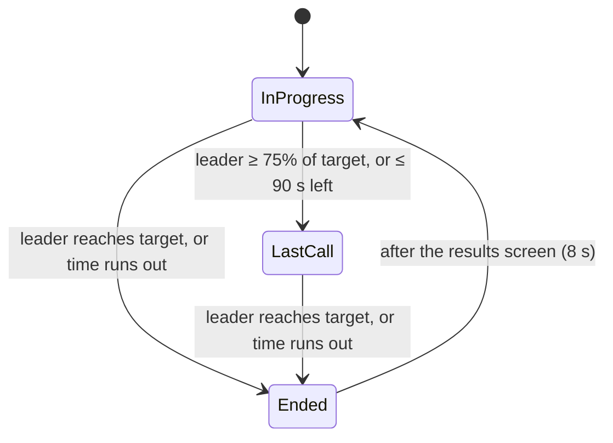

# Match loop

`core/MatchServer.cs` runs the match on the server (and in offline practice). Clients only react
to its broadcasts.

## States

The numbers come from `tuning.tres`: `ScoreTargetDuelPit` 25, `ScoreTargetChaos` 40,
`MatchTimeLimitSeconds` 480, `LastCallThresholdPercent`, `LastCallTimeRemainingSeconds` and
`ResultsScreenDurationSeconds`. The server's `--config` picks the score target.

## Scoring

Every kill goes through `MatchServer.ServerRegisterKill(attacker, victim, method)`:

- **Points:** 1 plus the victim's bounty, ×2 while holding the Golden Knife.
- **Bounty:** each kill raises your bounty by 1, and dying resets it. Streaks of 3, 5 and 8 are
  announced ("IS ON A TEAR", "UNSTOPPABLE").
- **Golden Knife:** it appears in the centre after 45 s. Picking it up makes every hit a one-hit
  kill for 20 s. You lose it on death, and it respawns 30 s later. While someone holds it, a
  column of gold light rises from them into the sky (`effects/GoldenBeam`), visible to everyone
  from anywhere on the map, and "NAME TOOK THE GOLDEN KNIFE" is announced on screen in gold. The
  server sends the holder with `MatchServer.BroadcastKnifeHolder` (-1 when it's lost or a new
  match starts); each client attaches the beam to that player and swaps their knife for the
  Golden Knife model (`Player.SetHoldsGoldenKnife`, back to their own knife when it's lost).
  While it waits on the plinth, every client shows the same model spinning above it with a gold
  light (`MatchServer.SetKnifeVisual`). The model is `assets/props/golden_knife/golden_knife.tscn`
  (the "Buck Knife" FBX, with its PBR textures in `golden_knife_material.tres`).
- **Kills and deaths** are counted per player for the match report.
- Last Call shortens respawns to `RespawnTimeLastCall`.

## End of match

`EndMatch()` does four things:

1. Picks the MVP (highest score) and computes **awards** from match telemetry: Most Stabbed In The
   Back, Untouchable (most strikes dodged), All Bark No Bite, Highway Robbery. A stat of 0 gets no award.
2. Broadcasts the results, which fill the results panel in `KillfeedUI`.
3. **Reports the match to the lobby** (`RoomReporter.ReportMatch`, lobby rooms only): every player
   who took part, including anyone who scored and then left, with character, score, kills, deaths
   and the awards.
4. Legacy: `SeasonStats` writes a JSON file, but only on a server **not** started by the lobby.

## Client sync

Clients get state three ways:

- `BroadcastMatchClock` every second and on every state change: state, clock, score target and all
  scores. Late joiners and drift are covered.
- `BroadcastScore` right after each kill.
- `BroadcastAnnouncement` for banners (Last Call, bounty, knife, match over).

Between clock syncs, clients count down locally so the timer moves smoothly.
