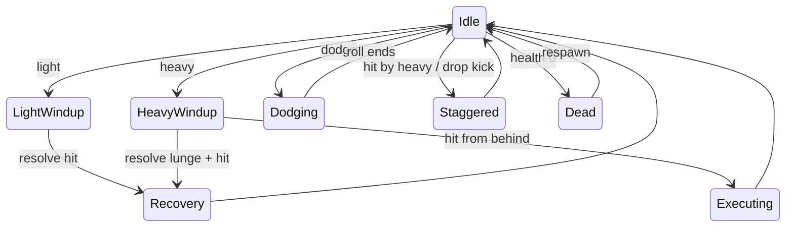

# Combat

All bindings can be changed in Settings → Controls; controllers are covered in
[Getting started](../getting-started.md#controls).

**Aiming:** the mouse (or right stick) turns the camera, and your character turns to face the way you walk.
Pressing an attack or your ability turns you to face the camera's direction at once, and holds
that for 0.8 s, so you always strike where you aim.

All combat is resolved **on the server** (`player/Player.cs`, `core/CombatServer.cs`). A client only
asks to use a verb. The numbers below are the current values in `tuning/tuning.tres`.

## Verbs

| Verb | Input | Behaviour |
|---|---|---|
| **Light** (the normal hit) | Left mouse / RB (R1) | 0.12 s windup, 2 m reach, **35% health**. 0.15 s recovery. |
| **Heavy lunge** | Right mouse / RT (R2) | 0.4 s windup (a visible tell), then lunges up to 3 m and hits for **52.5% health, 1.5× a light hit**. Staggers the victim 0.4 s. 0.6 s recovery, which is the punish window when it whiffs. |
| **Execute** | Heavy from behind | A heavy that lands within 60° of the victim's back kills instantly. 0.6 s lock. |
| **Dodge (roll)** | Cmd (Mac) / Ctrl / B (Circle) | A 3.5 m roll in 0.55 s, in the direction you're moving when you press it (or facing, if standing still). The direction is **locked for the whole roll**: letting go of the keys or pressing another direction doesn't bend or stop it. **Strikes pass through you for the whole roll**: your hitbox is hidden, so a swing can still hit someone behind you. No cooldown: you can roll again as soon as a roll ends, as long as you have the stamina (30 each). Only from idle, so you can't roll out of your own attack's recovery. |
| **Sprint** | Shift / LT (L2), held | Move speed ×1.6 (6 → 9.6 m/s) while held. Costs stamina. |
| **Jump** | Space / A (Cross) | A small hop (about 0.8 m). Turn it off with `HopEnabled` for playtests. |
| **Vault** | Jump while moving at cover | If `Player.FindVault` finds cover `VaultMinHeight`–`VaultMaxHeight` (0.5–1.5 m) tall within `VaultReach` (0.8 m) of the capsule, the jump becomes a vault: take-off speed just enough for the feet to clear the top by `VaultClearance` (0.4 m), and a horizontal `VaultSpeed` (5 m/s) held until landing (no steering, the body faces the vault). Players are never cover. Runs in `SimulateStep`, so the server decides it and the owner predicts it. |
| **Ability** | E / Y (Triangle) | One per character, see [Abilities](abilities.md). Zain's Drop Kick hits for 2× a light hit, 7 s cooldown. |

There is **no parry**: the dodge replaced it (decision D7 in `plan/main.md`).

**Stamina** (the green bar) limits both:

- sprint drains 22/s, about 4.5 s from full;
- a dodge costs 30 and is refused without enough;
- it refills at 30/s after a 0.8 s pause;
- once it runs dry you can't sprint again until it's back to 15, so the sprint doesn't flicker
  at empty.

The server tracks it, and your screen predicts it.

Health is 100. **Regeneration:** after 3 s without being hit you heal +1 HP every second, up to
full; any hit restarts the 3 s wait. The server does it (`Player.ServerTickRegen`), and every
player sees green "+" signs rise from a healing player. The numbers are `HealthRegenDelay`,
`HealthRegenAmount` and `HealthRegenInterval` in `tuning.tres`.

You respawn after 1.5 s (1.0 s during Last Call), with 1.5 s of spawn protection
(a pulsing pale shimmer; the texture stays visible). The server starts and cancels it and tells
every client, so everyone sees the same shimmer. Protection ends the moment you attack, roll or
use your ability. At 0 health your character plays its **death animation** and stays down until
it respawns.

## State machine (per player, server-side)

## Fairness rules (Pillar 2)

- Hits are tested against where the target **was on the attacker's screen**, using server-side
  rewind capped at 0.2 s. See [Networking](../architecture/networking.md#hit-detection-with-rewind).
- The dodge's invulnerability is decided by the server (`Dodging` state). Your own roll is
  predicted on your screen so it starts instantly; if the server refuses it (for example you were
  still recovering from a swing), you're corrected back.
- The killfeed names the killer and the method (light / heavy / execute / ability name).
- Every hit that **lands** plays a stab sound where the victim stands, as positional 3D audio, so
  you can hear which way it came from. Heavies sound lower and louder. Dodged and
  spawn-protected strikes are silent.
- A 1.5 s death camera turns you toward your killer.
- Swings, rolls, tells and deaths are shown from server broadcasts, so nothing you see is a guess.

**Mac note:** Cmd is also the system modifier. Cmd+Q still quits the game, since nothing in the
game is bound to Q any more. Ctrl works as the dodge key on every platform.
